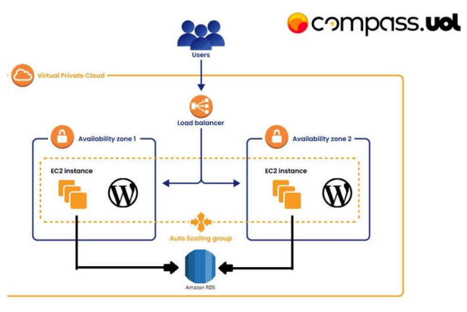

# Desafio 02 - Projeto: Implantação de WordPress na AWS



## Introdução

Este projeto demonstra a configuração e o deployment de uma aplicação WordPress utilizando serviços da AWS, criando uma infraestrutura escalável e altamente disponível.

## Arquitetura do Projeto

- **Duas Instâncias de Servidor WordPress:**

  - Contêineres que hospedam a aplicação WordPress.
  - Compartilham os arquivos estáticos via Amazon EFS para garantir consistência entre as instâncias.  

- **Amazon RDS (Relational Database Service):**

  - Serviço gerenciado de banco de dados utilizado para armazenar os dados do WordPress, como configurações, posts e usuários.  

- **Load Balancer:**

  - Balanceador de carga da AWS que distribui o tráfego entre as instâncias do WordPress, garantindo alta disponibilidade e escalabilidade.  

- **Amazon EFS (Elastic File System):**

  - Sistema de arquivos compartilhado utilizado para armazenar arquivos estáticos do WordPress (uploads, temas e plugins), acessível simultaneamente por todas as instâncias.

## Criação e configuração dos recursos

Nesta etapa, são demonstradas as configurações dos recursos necessários para a criação da arquitetura do projeto e sua execução/inicialização.

- **VPC**

  - Ir para a área de criação da VPC
  - Nome da instância: my-vpc
  - Faixa de IPs para permitir a criação de sub redes: 10.0.0.0/16
  - VPC criada!

- **Security Groups**

  - **Grupo de segurança para as instâncias**:
    - Nome: my-sec-grp-ec2
    - Portas de entrada:
		| Tipo  | Protocolo |  Porta |         Origem           |
		|-------|-----------|--------|--------------------------|
		| HTTP  |    TCP    |   80   | Grupo de Segurança do LB |
		| SSH   |    TCP    |   22   | IP da máquina            |
  - Grupo de segurança para o RDS:
    - Portas de entrada:
		|      Tipo      | Protocolo | Porta |           Origem              |
		|----------------|-----------|-------|-------------------------------|
		| MySQL/Aurora   |    TCP    |  3306 | Grupo de Segurança do EC2     |
  - Grupo de segurança para o EFS:
    - Portas de entrada:
		| Tipo  | Protocolo | Porta |         Origem            |
		|-------|-----------|-------|---------------------------|
		|  NFS  |    TCP    | 2049  | Grupo de Segurança do EC2 |
  - Grupo de segurança para o Load Balancer:
    - Nome: my-sec-grp-lb
	- Portas de entrada:
		| Tipo  | Protocolo |  Porta |  Origem   |
		|-------|-----------|--------|-----------|
		| HTTP  |    TCP    |   80   | 0.0.0.0/0 |

- **Internet Gateway**

  - Nome da instância: my-internet-gateway
  - Anexar à VPC
  - IGW criado!

- **Route Table**

  - Nome da instância: my-route-table
  - Route Table criado!
  - Selecione a instância
  - Edite as regras de entrada
  - Anexar o Internet Gateway

- **Subnets**

  - Subnet 1:
    - Nome da instância: my-subnet-01
    - Faixa de de IPs para a subnet: 10.0.1.0/24
    - Zona de disponibilidade: us-east-1a
  - Subnet 2:
    - Nome da instância: my-subnet-02
    - Faixa de de IPs para a subnet: 10.0.2.0/24
    - Zona de disponibilidade: us-east-1b
  - Anexar as subnets ao Route Table
  
- **EFS**

  - Ir para a área de criação do EFS
  - Nome da instância (opcional): my-efs
  - Selecione a VPC: my-vpc
  - EFS criado!
  - Selecione a instância
  - Clique em "Attach"
  - Copie o ID

- **RDS**

  - Ir para a área de criação do RDS
  - Nome da instância: database-1
  - Banco: MySQL
  - Tipo de instância: t3.micro
  - Autenticação
    - Usuário: admin
    - Senha: minha-senha
  - Tabela no banco: minha-tabela
  - Selecione a VPC: my-vpc
  - RDS criado!

- **Instâncias**

  - Ir para a área de criação das instâncias
  - Criar as duas instâncias em subnets diferentes:
    - my-subnet-01
    - my-subnet-02
  - Adicionar as tags
  - Tipo: t3.micro
  - VPC: my-vpc
  - Grupo de Segurança: my-sec-grp-ec2
  - Adicionar o user_data.sh
  - Instâncias criadas!

- **Target Group**:

  - Ir para a área de criação do Target Group
  - Nome da instância: my-target-group
  - Selecionar as instâncias
  - Selecionar a porta 80
  - Registrar instâncias
  - Target Group criado!

- **Load Balancer**

  - Ir para a área de criação do Load Balancer
  - Nome da instância: my-load-balancer
  - Grupo de Segurança: my-sec-grp-lb
  - Target Group: my-target-group
  - Load Balancer criado!

## Script de Inicialização

O script de inicialização (user_data.sh) para instalação automática do Docker, configuração do docker-compose.yml para a criação dos containers do WordPress.

```bash
#!/bin/bash

# Variáveis de ambiente
export ENDERECO_EFS="<ENDERECO_EFS>"
export WORDPRESS_DB_HOST="<WORDPRESS_DB_HOST>"
export WORDPRESS_DB_USER="<WORDPRESS_DB_USER>"
export WORDPRESS_DB_PASSWORD="<WORDPRESS_DB_PASSWORD>"
export WORDPRESS_DB_NAME="<WORDPRESS_DB_NAME>"
export DIRETORIO_VOLUME="/mnt/dados"

# Instalar Docker
sudo yum update -y
sudo yum install -y docker
sudo service docker start

# Instalar Docker Compose
curl -L "https://github.com/docker/compose/releases/latest/download/docker-compose-$(uname -s)-$(uname -m)" -o /usr/local/bin/docker-compose
chmod +x /usr/local/bin/docker-compose

# Instalar NFS
sudo yum -y install nfs-utils
sudo systemctl enable nfs-utils
sudo systemctl start nfs-utils

# Montagem do sistema de arquivos
sudo mkdir -p $DIRETORIO_VOLUME
sudo chmod -R 777 $DIRETORIO_VOLUME
echo "#
UUID=3a8023d8-2841-47f7-985b-ab4b5825ae27     /           xfs    defaults,noatime  1   1
UUID=A012-E846        /boot/efi       vfat    defaults,noatime,uid=0,gid=0,umask=0077,shortname=winnt,x-systemd.automount 0 2
$ENDERECO_EFS:/ $DIRETORIO_VOLUME nfs4 nfsvers=4.1,rsize=1048576,wsize=1048576,hard,timeo=600,retrans=2,noresvport 0 0" | sudo tee  /etc/fstab
sudo mount -a

# Iniciar o WordPress com Docker Compose
cat <<EOF > docker-compose.yml
version: '3.9'

services:
  wordpress:
    image: wordpress
    restart: always
    ports:
      - 80:80
    environment:
      WORDPRESS_DB_HOST: $WORDPRESS_DB_HOST
      WORDPRESS_DB_USER: $WORDPRESS_DB_USER
      WORDPRESS_DB_PASSWORD: $WORDPRESS_DB_PASSWORD
      WORDPRESS_DB_NAME: $WORDPRESS_DB_NAME
    volumes:
      - $DIRETORIO_VOLUME:/var/www/html
EOF

# Subir aplicação
docker-compose down
docker-compose up -d
```
